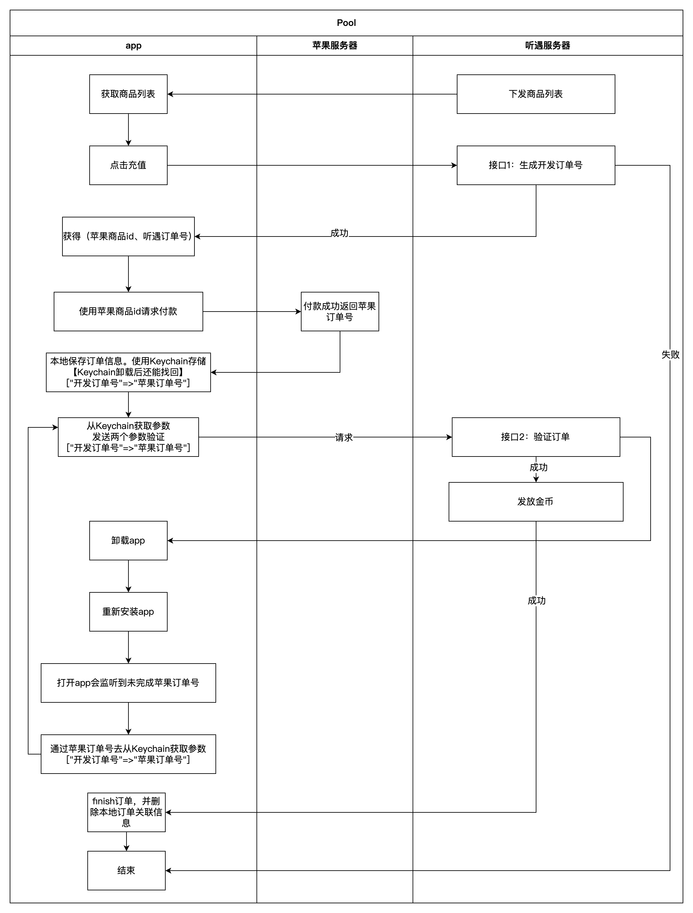

# 苹果内购 SDK for PHP  !

## 重要提示：

> verifyReceipt 端点已弃用。要在你的服务器上验证收据，请在服务器上执行在设备上验证收据 中的步骤。要在你的服务器上不使用收据验证
> App 内购买项目，请调用 App Store Server API 获取顾客的 Apple 签名的交易和订阅信息，或者验证你的 App 获取的 AppTransaction
> 和 Transaction 签名的数据。你也可以从 App Store Server Notifications V2 获取同样的签名交易和订阅信息。
[获取交易历史V1【苹果官网废弃说明】](https://developer.apple.com/documentation/appstoreserverapi/get_transaction_history_v1 "获取交易历史V1【废弃说明】")
[通过 App Store 验证收据【苹果官网废弃说明】](https://developer.apple.com/cn/documentation/storekit/in-app_purchase/validating_receipts_with_the_app_store/ "通过 App Store 验证收据【苹果官网废弃说明】")

> 苹果已经把v1版本废弃了，预计2-3年就会彻底要求迁移

### 主要新特性

* 简化使用方法
* 调用简单，统一原样返回
* 可执行单元测试

### 更新日志

| 版本号   | 更新内容                                                                                         | 备注 | 更新日期       |
|-------|----------------------------------------------------------------------------------------------|----|------------|
| 1.0.0 | 增加验证苹果内购凭据，支持沙盒模式                                                                            | -  |            |
| 2.0.0 | 增加《Get Transaction History》《获取交易历史消息》v2版本（直接跳过v1版本）<br>2. 新版本不支1.0.0旧版本凭据验证，如需使用请直接使用1.0.0版本 | -  | 2024年8月9日  |
| 2.1.0 | 增加《Get Transaction Info》《获取交易信息》                                                             | -  | 2024年9月19日 |

## 安装

> 运行环境要求PHP7.1+。

```shell
$ composer require cccdl/apple_sdk
```

## 使用教程

### v1.0.0

```php
$app = new Verify();
//开启沙盒模式 true=沙盒 false=生产正式
$app->setSandBox(true);
$res = $app->doVerify('苹果凭据');
```

### v2.0.0

```php
$config = Config::getConfig();
$app = new History($config, true);
$res = $app->getTransactionHistory('transactionId',[]);
```

## 苹果内购流程图



## 文档

[苹果开发者官网](https://developer.apple.com/)
[苹果开发者文档](https://developer.apple.com/cn/develop/)
[通过 App Store 验证收据](https://developer.apple.com/cn/documentation/storekit/in-app_purchase/validating_receipts_with_the_app_store/)
[verifyReceipt](https://developer.apple.com/documentation/appstorereceipts/verifyreceipt)
[requestBody](https://developer.apple.com/documentation/appstorereceipts/requestbody)

## 问题

[提交 Issue](https://github.com/cccdl/apple_sdk/issues)，不符合指南的问题可能会立即关闭。

## Contributing

You can contribute in one of three ways:

1. File bug reports using the [issue tracker](https://github.com/cccdl/apple_sdk/issues).
2. Answer questions or fix bugs on the [issue tracker](https://github.com/cccdl/apple_sdk/issues).
3. Contribute new features or update the wiki.

_The code contribution process is not very formal. You just need to make sure that you follow the PSR-0, PSR-1, and
PSR-2 coding guidelines. Any new code contributions must be accompanied by unit tests where applicable._

## License

MIT
